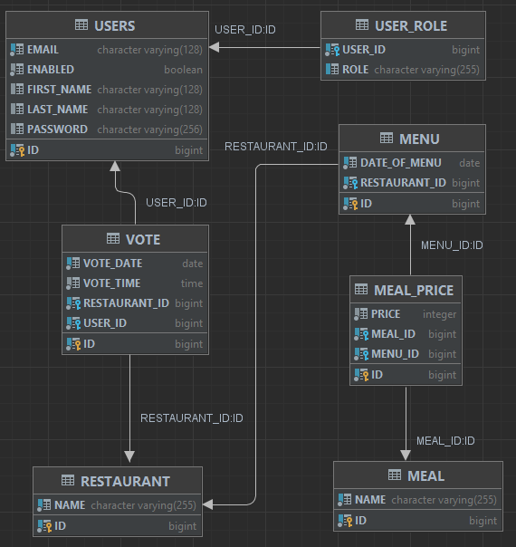

# Vote for lunch - votes counter

### Intro

Hi! Here you can find demo app that was written like test (and educational) task

By default, application starts on port 8095. This application is backend only and this is simple Spring Boot application, so you can run it just right out-of-the-box. 

### How it works

Link to Swagger: http://localhost:8095/swagger-ui.html

- The user can view menu lists for a specific date.
- The user can vote for a particular restaurant.
- The user's vote will be counted for the current date.
- It doesn't matter if the restaurant has a menu for that day or not.
- The user can vote from 00:00 until the time specified in the program settings (11:00). Or remove (withdraw) his vote.
- After the specified time, it is no longer possible to vote differently for today or withdraw the vote.
- The user can request the distribution of votes between restaurants for any date.
- The administrator has full access to all end-points.

### Technical requirement

Design and implement a REST API using Hibernate/Spring/SpringMVC (Spring-Boot preferred!) without frontend.

The task is: Build a voting system for deciding where to have lunch.

* 2 types of users: admin and regular users
* Admin can input a restaurant, and it's lunch menu of the day (2-5 items usually, just a dish name and price)
* Menu changes each day (admins do the updates)
* Users can vote for a restaurant they want to have lunch at today
* Only one vote counted per user
* If user votes again the same day:
* If it is before 11:00 we assume that he changed his mind.
* If it is after 11:00 then it is too late, vote can't be changed
* Each restaurant provides a new menu each day.

As a result, provide a link to GitHub repository. It should contain the code, README.md with API documentation and couple curl commands to test it (better - link to Swagger).

P.S.: Make sure everything works with the latest version that is on github :)
P.P.S.: Assume that your API will be used by a frontend developer to build frontend on top of that.

### Used technologies

**Spring Boot / Spring Data JPA / H2 database / Spring Security / Jackson / Ehcache / Spring Validation / Lombok / Spring Tests / Swagger**

- For simplicity, I am using an in-memory H2 database that is populated with some test data using InitializeData#commandLineRunner
- ORM framework is Spring Data JPA
- Entities are mapped to DTOs using simple mapper classes without using Mapstruct or other complex libraries
- The application uses ehCache for caching. According to the application logic, MenuService and VoteService#getVotesDistributionOnDate uses the cache. Cached: menu GET operations, votes distribution

### Database structure

### Security

Users for tests:
- Administrator _login admin@ya.ru_ password _admin_
- User login _user@ya.ru_ password _user_

Self-registration of users is not implemented

### Password storage

For clarity, the credentials that are generated when the program starts are not encrypted.
The program implements the following logic for working with users:
- When creating a new user, his password is encrypted at the stage of converting UserDto to User
- When converting User to UserDto for return to the frontend, the password is hidden
- When updating the data of an already existing user in the database, the password does not change
- To change the password, a separate functionality must be implemented but that is not implemented in this version of the program
- To change roles, a separate functionality must be implemented but that is not implemented in this version of the program

### TODO

- use Mapstruct to implement mappers
- use Liquibase to automate database change process
- add change password functionality
- add more login options like OAuth2
- add more test cases
